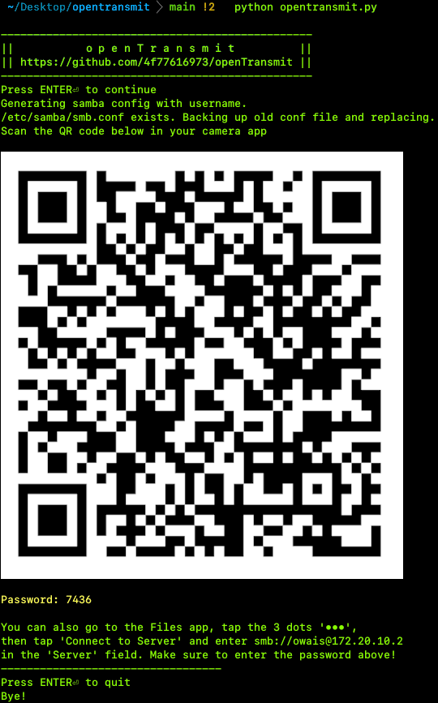

<!---->
<!---->

# openTransmit

A quick-and-dirty Linux Python script to setup a local SMB server and display its QR Code to use with iOS's Files.app.

## HOW TO

### Download via clone

Make sure you have Git, Python and pip installed, then open a terminal and type `git clone https://github.com/4f77616973/openTransmit`.

### Run via Docker
Using Docker, you can avoid messing with system-level files and run Docker in a virtualized environment.
1. [Install and enable Docker](https://docs.docker.com/engine/install/) on your system. Don't forget to start the docker daemon.
2. Make the docker setup script executable by running `chmod +x opentransmit-docker.sh`.
3. Run the docker script to start openTransmit in Docker.
<!--2. Build the image from the Dockerfile by running `sudo docker build -t opentransmit`.
3. Run the Docker image via `sudo docker run -e USER=$USER -it opentransmit opentransmit.py`.-->

_**Note:** to specify a custom password via a flag, run `sudo opentransmit-docker.sh asdf` where `asdf` is the password._

<b>- OR -</b>

### Run via Bash

Run the script by changing to its directory and typing `python opentransmit.py`. 

_**Note:** to specify a custom password via a flag, run `python opentransmit.py asdf` where `asdf` is the password._

### Usage

1. Open the Camera app on your iPhone / iPad / iPod Touch running iOS 11+
2. Scan the QR code displayed on the terminal and tap on the 'Files' notification that appears
3. Tap 'Connect' on the top right corner, then enter the password displayed below the QR Code
4. Once done, hit Enter⏎ on your computer to stop the script

## LICENSE

[Copyright © 2021 Owais Shaikh](LICENSE)

This project is licensed under the GNU General Public License Version 3 (GPL v3).

GitLab: [ThomasCat](https://gitlab.com/ThomasCat) | GitHub: [4f77616973](https://github.com/4f77616973) | Contact: [Email](mailto://0x4f@tuta.io)
